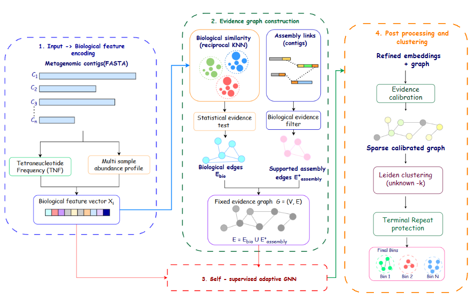
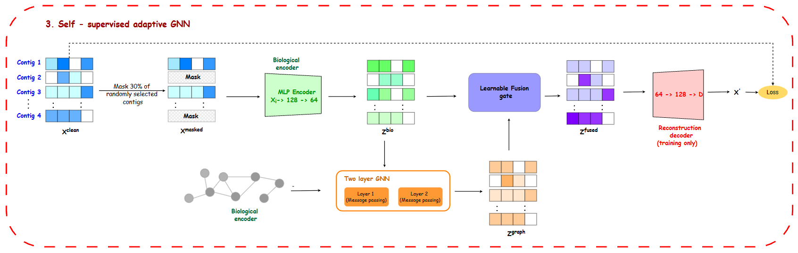
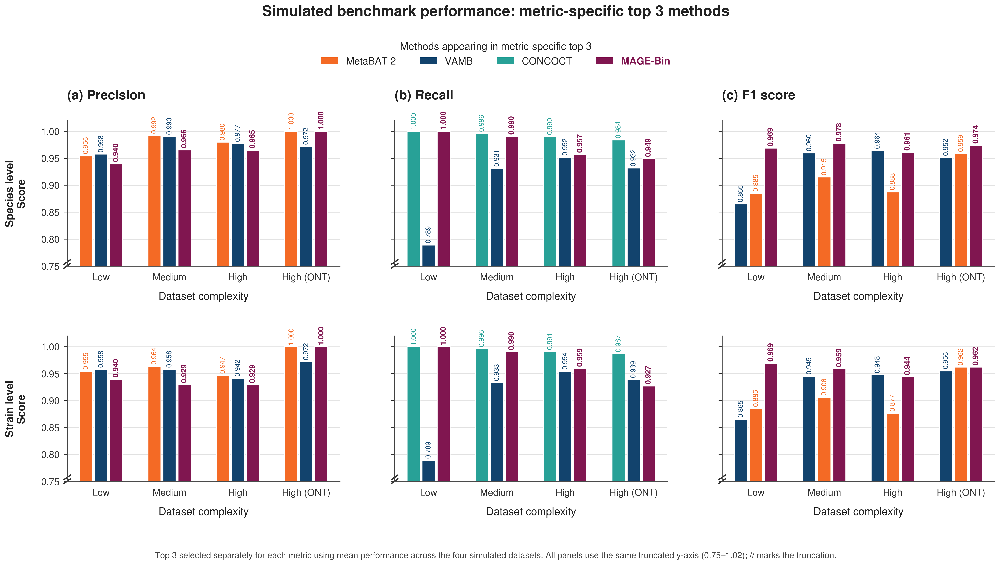
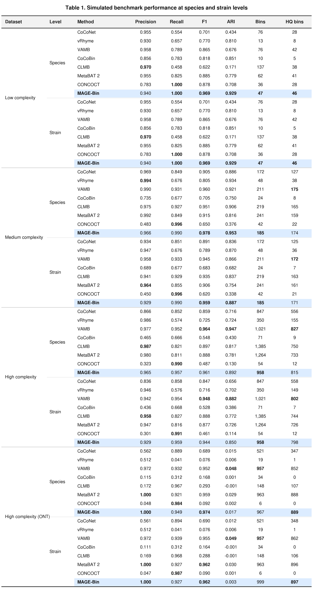
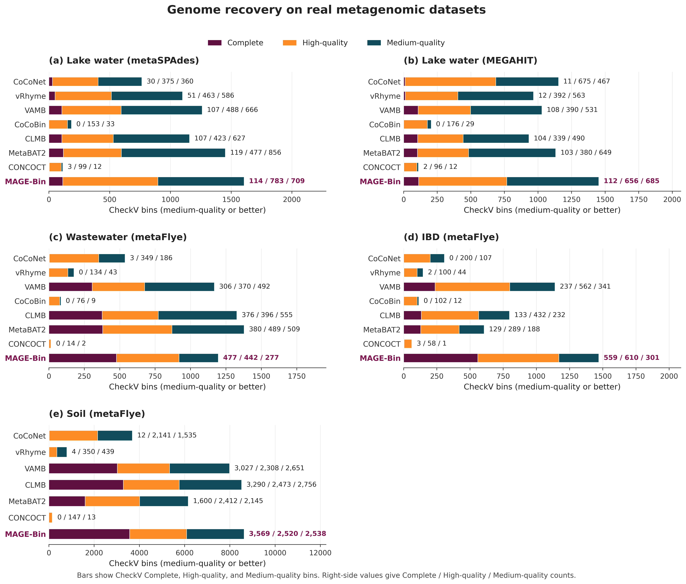
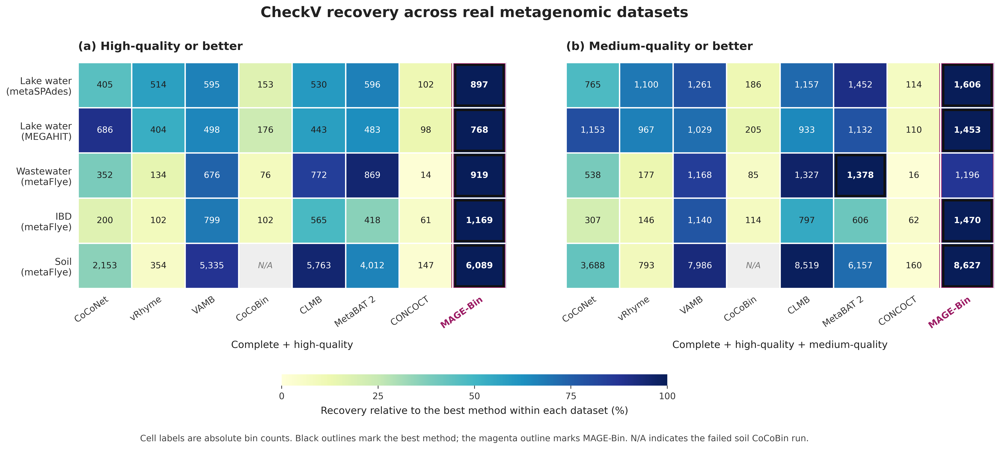
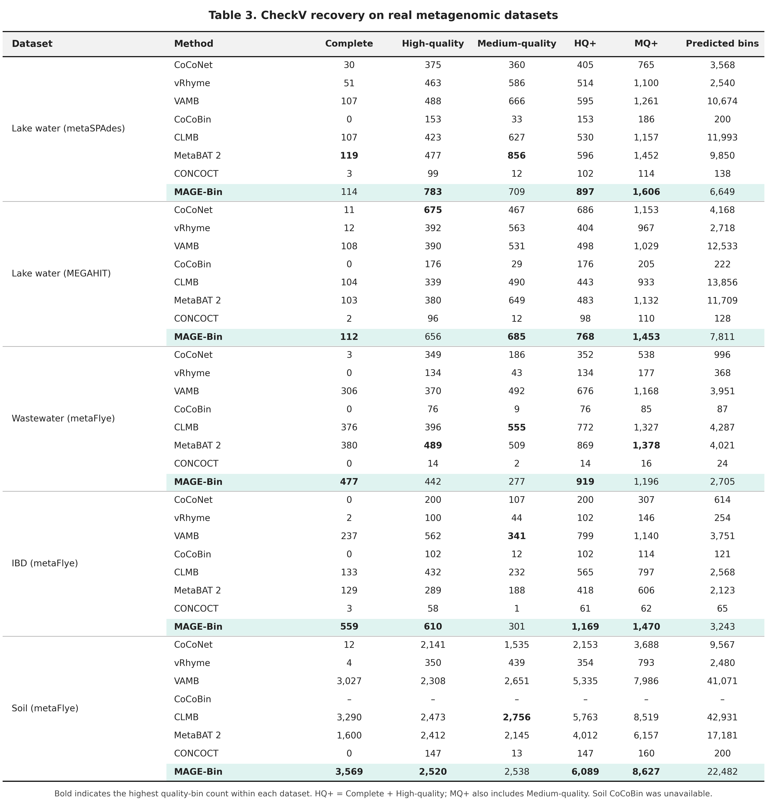
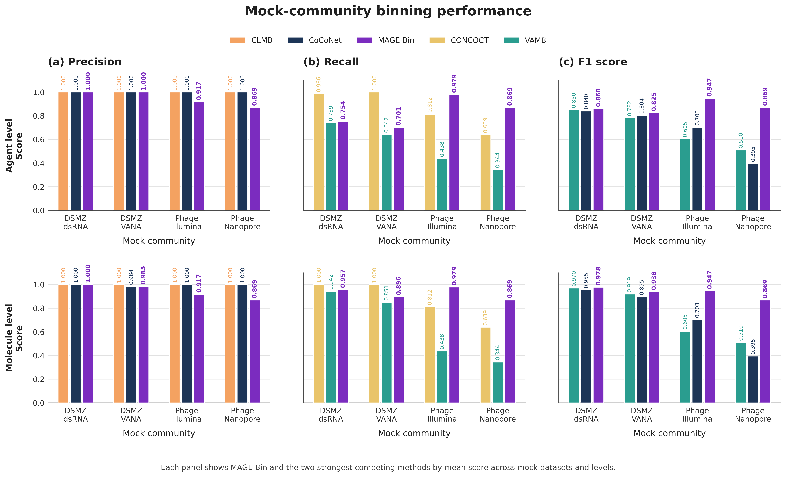
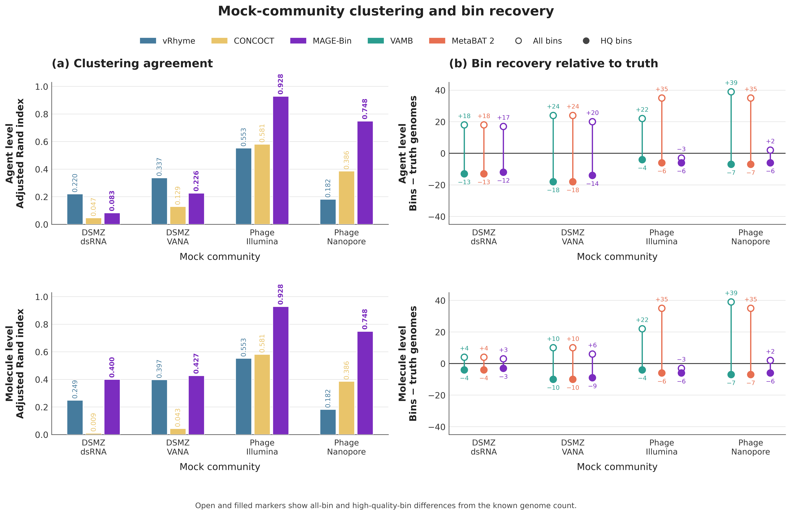
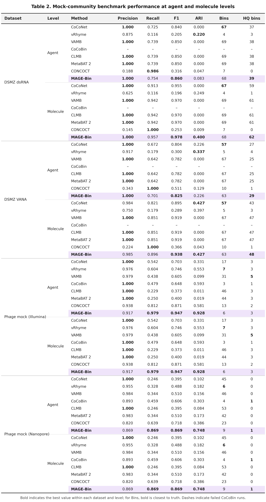

# MAGE-Bin

**M**asked **A**daptive **G**raph-**E**vidence **Bin**ning for viral metagenomes.

MAGE-Bin is a label-free method for viral metagenomic binning. It combines
tetranucleotide composition, one or more abundance profiles, statistical graph evidence,
and biologically supported assembly-graph links to group viral contigs into bins.

MAGE-Bin uses self-supervised masked reconstruction to learn contig
representations. A learnable fusion gate controls how much graph information
contributes to the final representation. Ground-truth genome labels and CheckV
scores are not used during training, model selection, or clustering.

## Contents

- [Name](#name)
- [Model architecture](#model-architecture)
- [Installation](#installation)
- [Quick start](#quick-start)
- [Prepared dataset input](#prepared-dataset-input)
- [Output](#output)
- [Method overview](#method-overview)
- [Benchmark datasets](#benchmark-datasets)
- [Benchmark results](#benchmark-results)
- [Reproducibility](#reproducibility)
- [Checking the installation](#checking-the-installation)
- [Development](#development)
- [Research code and notebooks](#research-code-and-notebooks)
- [Citation](#citation)
- [License](#license)

## Name

| Part | Stands for | Meaning in the method |
|---|---|---|
| **M** | Masked | 30% of training contigs have their features masked per epoch, and the encoder learns by reconstructing them. |
| **A** | Adaptive | A learnable fusion gate sets how much graph information enters each contig representation. |
| **GE** | Graph-Evidence | Contigs are linked only by statistically supported similarity, plus assembly links that have independent biological support. |
| **Bin** | Binning | Contigs are grouped into viral genome bins without specifying the number of genomes. |

## Model architecture



MAGE-Bin has four stages:

1. **Biological feature encoding.** Each contig is represented by its tetranucleotide
   composition and its per-sample abundance profile.
2. **Evidence graph construction.** Reciprocal k-nearest-neighbour pairs are kept only
   when a statistical evidence test supports them. Assembly links are added only when
   they pass an independent biological evidence filter.
3. **Self-supervised adaptive GNN.** The encoder is trained without genome labels. At
   the configured update interval, the training graph is rebuilt using the current
   embedding together with the composition, coverage, and supported assembly evidence.
4. **Post-processing and clustering.** Evidence is calibrated into a sparse graph,
   clustered with Leiden without a preset number of bins, and terminal-repeat evidence
   protects likely complete genomes from merging.

### Self-supervised adaptive GNN



Features of 30% of training contigs are masked at each epoch. An identity branch projects
the input features directly to 64 dimensions. A two-layer graph branch
(input → 128 → 64) passes messages over the current evidence graph. The learnable
fusion gate combines the two branches, and a reconstruction decoder
(64 → 128 → input) is used only during training. Held-out masked reconstruction is
used for checkpoint selection and early stopping.

## Installation

MAGE-Bin requires Python 3.10 or later.

Install the current release from [PyPI](https://pypi.org/project/magebin/):

```bash
pip install magebin
```

Check the installation:

```bash
magebin --version
magebin doctor
```

### PyTorch

MAGE-Bin uses PyTorch. The standard installation above allows `pip` to resolve the
declared Python dependencies automatically.

If you require a particular CPU or CUDA build of PyTorch, install the appropriate
PyTorch build for your system before installing MAGE-Bin.

## Quick start

Run MAGE-Bin on assembled contigs, per-contig coverage, and a GFA assembly graph:

```bash
magebin run \
    --contigs contigs.fasta \
    --coverage coverage.tsv \
    --graph assembly_graph.gfa \
    --output results/
```

The GFA is required and must contain links that map to retained FASTA contigs.
When its segment IDs differ from the FASTA contig IDs,
provide a GFA `P` path for each contig or pass SPAdes' `contigs.paths` using
`--paths contigs.paths`. A `contigs.paths` beside the FASTA or GFA is found
automatically. MAGE-Bin writes prepared features in
`results/preprocessed/`, then writes assignments and run metadata in `results/`.
The prepared directory contains the files MAGE-Bin needs for inference, in the
same format as those files under `Data/Processed_data/`; the research pipeline's
extra benchmark and protein feature files are outside this command's input contract.
The FASTA may also be gzipped. Coverage may be tab or comma separated and must
have a `contig` column plus at least one numeric sample column; every retained
FASTA contig needs a nonnegative coverage row.

For example:

```text
contig    sample_1    sample_2
contig_1  12.4        8.7
contig_2  3.1         0.0
```

Contig identifiers are the first whitespace-delimited token in each FASTA header and
must match the coverage and graph/path identifiers. `magebin run` starts from assembled
contigs: it does not assemble raw reads or calculate coverage from read alignments.

For an already prepared, model-ready dataset directory, use the existing command:

```bash
magebin bin /path/to/dataset \
    --output /path/to/results
```

For example, to force CPU execution:

```bash
magebin bin /path/to/dataset \
    --output /path/to/results \
    --device cpu \
    --seed 0
```

Run the following command to see all available options:

```bash
magebin run --help
```

## Prepared dataset input

The `magebin bin` command accepts a preprocessed, model-ready dataset directory.

The directory must contain:

- `config.json`
- `contig_metadata.tsv`
- `tnf_counts.npz`
- `viral_graph.pt` when assembly-graph information is available

`contig_metadata.tsv` must include:

- `node_index`
- `contig_id`
- `length`

`tnf_counts.npz` must contain the `names` and `counts` arrays used for
tetranucleotide composition.

### Coverage

Coverage can be supplied explicitly:

```bash
magebin bin /path/to/dataset \
    --coverage /path/to/coverage.csv \
    --output /path/to/results
```

When `--coverage` is not provided, MAGE-Bin searches for coverage information
using the dataset configuration.

The benchmark preprocessing workflow is available in the `Dataset_Processing/`
directory of the GitHub repository. `magebin run` provides the user-facing
conversion from assembled contigs, coverage, and GFA to this format. It does
not assemble raw sequencing reads or calculate coverage from them.

## Output

MAGE-Bin writes its results to the directory specified with `--output`.

The main outputs are:

### `bins/`

Contains one FASTA file per predicted bin, with the original contig sequences
kept as separate FASTA records. This directory is written when the prepared dataset's
`config.json` points to an available source FASTA; it is always available for
`magebin run` output.

### `assignments.tsv`

Contains the final contig-to-bin assignments, including:

- `contig_id`
- `bin_id`
- contig `length`

### `run.json`

Records information about the run, including model parameters, learned fusion
weights, graph statistics, timing information, and output summary.

### `terminal_repeats.tsv`

Stores cached terminal-repeat evidence when sequence information is available and the
complete-contig gate is enabled.

## Method overview

MAGE-Bin combines biological features and graph information in a self-supervised
binning framework.

The main steps are:

1. **Biological feature construction**  
   Tetranucleotide composition and per-sample abundance are used to represent
   each viral contig.

2. **Statistical graph construction**  
   Candidate relationships between contigs are evaluated using biological
   similarity and empirical evidence calibration.

3. **Assembly-graph support**  
   Assembly relationships are treated as candidate links. An assembly link is
   retained only when it has positive independent biological evidence from the
   available composition and coverage information.

4. **Self-supervised representation learning**  
   A graph encoder is trained using masked feature reconstruction. The graph is updated
   periodically from the learned representation and the input evidence. No ground-truth
   genome labels are required.

5. **Learnable graph fusion**  
   The encoder learns a convex gate between the identity representation and
   graph-derived representation.

6. **Unknown-K clustering**  
   The learned representations and biological evidence are used to construct a
   sparse clustering graph. MAGE-Bin determines the bins without requiring the
   number of viral genomes to be specified beforehand.

7. **Completeness protection**  
   Terminal-repeat evidence can protect likely complete viral contigs from
   inappropriate merging.

Assembly edges are treated as biological evidence rather than ground truth.
Supported assembly edges are added to the statistical graph without deleting or
reweighting the existing statistical edges.

CheckV is used only for downstream biological evaluation. CheckV scores are not
used for training, model selection, graph construction, or clustering.

## Benchmark datasets

The primary benchmark compares MAGE-Bin with seven external binners (CoCoNet, vRhyme,
VAMB, CoCoBin, CLMB, MetaBAT 2 and CONCOCT) on three kinds of data. Every method is
evaluated on the same cohort of contigs of at least 2,000 bp. An incomplete Avibin trial
is retained in the real-data CSV but excluded from the primary comparison. The tool
setup and evaluation rules are in
[`Other_Tools/README.md`](Other_Tools/README.md).

| Type | Reads | Ground truth | Evaluation |
|---|---|---|---|
| Simulated | simulated | yes, from the simulator | precision, recall, F1, ARI, HQ bins |
| Real | real | none | CheckV quality of the bins |
| Mock community | real | yes, recovered by aligning contigs to the reference genomes | precision, recall, F1, ARI, HQ bins |

### Simulated datasets

Communities are sampled from five biomes and expanded into near-identical strains. Reads
are simulated with InSilicoSeq (Illumina) or Badread (Nanopore).

| Dataset | Genomes in community | Strain complexity | Samples | Reads | Assembler | Truth genomes, ≥2 kb (strain / species) | Contigs ≥2 kb | Pipeline |
|---|---:|---:|---:|---|---|---:|---:|---|
| Low complexity | 50 | 5% | 15 | Illumina (InSilicoSeq) | metaSPAdes | 49 / 49 | 166 | [Simulated_Data](Dataset_Processing/Simulated_Data/README.md) |
| Medium complexity | 200 | 20% | 15 | Illumina (InSilicoSeq) | metaSPAdes | 192 / 188 | 524 | [Simulated_Data](Dataset_Processing/Simulated_Data/README.md) |
| High complexity | 998 | 40% | 15 | Illumina (InSilicoSeq) | metaSPAdes | 967 / 917 | 2,787 | [Simulated_Data](Dataset_Processing/Simulated_Data/README.md) |
| High complexity (ONT) | 998 | 40% | 15 | Nanopore (Badread) | metaFlye | 926 / 919 | 1,000 | [Simulated_Data](Dataset_Processing/Simulated_Data/README.md) |

Each community draws an equal number of genomes from five biomes:

| Biome | Source | Genomes used | Link | Reference |
|---|---|---|---|---|
| Reference | NCBI RefSeq viral | complete genomes | [RefSeq viral release](https://ftp.ncbi.nlm.nih.gov/refseq/release/viral/) | [1] |
| Human gut | Metagenomic Gut Virus (MGV) catalogue | complete genomes | [MGV portal](https://portal.nersc.gov/MGV/) | [2] |
| Marine | IMG/VR v2.0 (January 2018 release) | high-quality marine genomes | [IMG/VR](https://img.jgi.doe.gov/vr/) | [3] |
| Soil | Global Soil Virus (GSV) Atlas | CheckV complete or high-quality | [doi:10.25584/2229733](https://doi.org/10.25584/2229733) | [4] |
| Freshwater | Self-circular contigs from public lake metagenomes | self-circular genomes | 15 BioProjects, see below | – |

The freshwater genomes come from 15 BioProjects. The largest contributors are
[PRJEB38681](https://www.ebi.ac.uk/ena/browser/view/PRJEB38681) (stratified lakes and ponds),
[PRJNA429141](https://www.ebi.ac.uk/ena/browser/view/PRJNA429141) (Římov reservoir),
[PRJNA429145](https://www.ebi.ac.uk/ena/browser/view/PRJNA429145) (Jiřická pond) and
[PRJEB15535](https://www.ebi.ac.uk/ena/browser/view/PRJEB15535) (Lake Soyang).

### Real datasets

The real datasets are the pre-built assemblies released with Phables [5] on Zenodo,
[doi:10.5281/zenodo.8137197](https://doi.org/10.5281/zenodo.8137197) (Phables v1.1.0
benchmarking data). In that release, reads from each BioProject were processed with
Hecatomb v1.0.1 [6] into one assembly graph per dataset, and the lake water reads were also
assembled with metaSPAdes and MEGAHIT. Viral contigs are identified with geNomad.

| Dataset | Environment | Accession | Samples | Sequencing | Assembly | Viral contigs ≥2 kb |
|---|---|---|---:|---|---|---:|
| IBD gut | Stool, IBD patients and household controls [7] | [PRJEB7772](https://www.ebi.ac.uk/ena/browser/view/PRJEB7772) | 12 | Illumina MiSeq | MEGAHIT + Flye (Hecatomb) | 6,360 |
| Lake water (metaSPAdes) | Nansi and Dongping lakes, Shandong, China | [PRJNA756429](https://www.ebi.ac.uk/ena/browser/view/PRJNA756429) | 6 | Illumina HiSeq 2500 | metaSPAdes | 14,604 |
| Lake water (MEGAHIT) | Nansi and Dongping lakes, Shandong, China | [PRJNA756429](https://www.ebi.ac.uk/ena/browser/view/PRJNA756429) | 6 | Illumina HiSeq 2500 | MEGAHIT | 16,512 |
| Paddy soil | Flooded paddy fields, Hunan, China | [PRJNA866269](https://www.ebi.ac.uk/ena/browser/view/PRJNA866269) | 12 | Illumina NovaSeq | MEGAHIT + Flye (Hecatomb) | 48,325 |
| Wastewater | Wastewater virome | [PRJNA434744](https://www.ebi.ac.uk/ena/browser/view/PRJNA434744) | 18 | Illumina MiSeq | MEGAHIT + Flye (Hecatomb) | 4,685 |

### Mock community datasets

Mock communities are real sequencing runs of communities built from known genomes. Each
contig is labelled by aligning it to the reference genomes; contigs the references do not
explain are left unlabelled and excluded from scoring. The pipeline is in
[`Dataset_Processing/Mock_Data`](Dataset_Processing/Mock_Data/README.md).

| Dataset | Community | Source | Libraries | Sequencing | Assembler | Truth genomes, ≥2 kb (agent / molecule) | Labelled / all contigs ≥2 kb |
|---|---|---|---:|---|---|---:|---:|
| Plant virus (dsRNA) | DSMZ plant-virus community, 115 reference molecules | [doi:10.57745/EMM5EQ](https://doi.org/10.57745/EMM5EQ) | 22 | Illumina, dsRNA protocol | MEGAHIT | 51 / 65 | 69 / 83 |
| Plant virus (VANA) | DSMZ plant-virus community, 115 reference molecules | [doi:10.57745/EMM5EQ](https://doi.org/10.57745/EMM5EQ) | 22 | Illumina, VANA protocol | MEGAHIT | 43 / 57 | 67 / 69 |
| 15-phage (Illumina) | 15 phages at known copy numbers | [PRJEB56639](https://www.ebi.ac.uk/ena/browser/view/PRJEB56639) | 3 | Illumina MiSeq | MEGAHIT | 9 / 9 | 48 / 167 |
| 15-phage (Nanopore) | 15 phages at known copy numbers | [PRJEB56639](https://www.ebi.ac.uk/ena/browser/view/PRJEB56639) | 7 | Nanopore MinION (5% subsample) | metaFlye | 7 / 7 | 61 / 457 |

Studies: plant-virus community, [J Virol 2023](https://doi.org/10.1128/jvi.01300-23);
15-phage community, [Microb Genom 2024](https://doi.org/10.1099/mgen.0.001198). The
*agent* level treats a segmented virus as one genome; the *molecule* level treats each
segment separately.

## Benchmark results

Best value per dataset is in bold. Scores for simulated and mock data use the GraphBin2
contig-count definitions of precision, recall and F1. Their `HQ bins` count is
truth-based: a bin must have at least 90% reference completeness and at most 5%
contamination. It is separate from CheckV quality categories. Real datasets have no
ground-truth assignments and are evaluated with CheckV.


### Simulated datasets

F1 score (species / strain).

| Method | Low | Medium | High | High (ONT) |
|---|---:|---:|---:|---:|
| **MAGE-Bin** | **0.969** / **0.969** | **0.978** / **0.959** | 0.961 / 0.944 | **0.974** / **0.962** |
| CoCoNet | 0.701 / 0.701 | 0.905 / 0.891 | 0.859 / 0.847 | 0.689 / 0.690 |
| vRhyme | 0.770 / 0.770 | 0.805 / 0.789 | 0.725 / 0.716 | 0.076 / 0.076 |
| VAMB | 0.865 / 0.865 | 0.960 / 0.945 | **0.964** / **0.948** | 0.952 / 0.955 |
| CoCoBin | 0.818 / 0.818 | 0.705 / 0.683 | 0.548 / 0.528 | 0.168 / 0.164 |
| CLMB | 0.622 / 0.622 | 0.951 / 0.935 | 0.897 / 0.888 | 0.293 / 0.288 |
| MetaBAT 2 | 0.885 / 0.885 | 0.915 / 0.906 | 0.888 / 0.877 | 0.959 / **0.962** |
| CONCOCT | 0.878 / 0.878 | 0.650 / 0.620 | 0.487 / 0.461 | 0.092 / 0.090 |




<details>
<summary>Full simulated results table</summary>



</details>

### Real datasets

Viral MAGs of CheckV medium quality or better.

| Method | IBD gut | Lake water (metaSPAdes) | Lake water (MEGAHIT) | Paddy soil | Wastewater |
|---|---:|---:|---:|---:|---:|
| **MAGE-Bin** | **1,470** | **1,606** | **1,453** | **8,627** | 1,196 |
| CoCoNet | 307 | 765 | 1,153 | 3,688 | 538 |
| vRhyme | 146 | 1,100 | 967 | 793 | 177 |
| VAMB | 1,140 | 1,261 | 1,029 | 7,986 | 1,168 |
| CoCoBin | 114 | 186 | 205 | – | 85 |
| CLMB | 797 | 1,157 | 933 | 8,519 | 1,327 |
| MetaBAT 2 | 606 | 1,452 | 1,132 | 6,157 | **1,378** |
| CONCOCT | 62 | 114 | 110 | 160 | 16 |

CoCoBin produced no CheckV-scorable output on the soil dataset.





<details>
<summary>Full real-data results table</summary>



</details>

### Mock community datasets

F1 score (agent / molecule). The all-singleton baseline is the score for placing every
contig in its own bin. On the plant-virus communities most genomes assemble into a single
contig, so this baseline is high.

| Method | Plant virus (dsRNA) | Plant virus (VANA) | 15-phage (Illumina) | 15-phage (Nanopore) |
|---|---:|---:|---:|---:|
| **MAGE-Bin** | **0.860** / **0.978** | **0.825** / **0.938** | **0.947** / **0.947** | **0.869** / **0.869** |
| CoCoNet | 0.840 / 0.955 | 0.804 / 0.895 | 0.703 / 0.703 | 0.395 / 0.395 |
| vRhyme | 0.205 / 0.196 | 0.300 / 0.289 | 0.746 / 0.746 | 0.488 / 0.488 |
| VAMB | 0.850 / 0.970 | 0.782 / 0.919 | 0.605 / 0.605 | 0.510 / 0.510 |
| CoCoBin | no bins / no bins | no bins / no bins | 0.648 / 0.648 | 0.606 / 0.606 |
| CLMB | 0.850 / 0.970 | 0.782 / 0.919 | 0.373 / 0.373 | 0.395 / 0.395 |
| MetaBAT 2 | 0.850 / 0.970 | 0.782 / 0.919 | 0.400 / 0.400 | 0.510 / 0.510 |
| CONCOCT | 0.316 / 0.253 | 0.511 / 0.366 | 0.871 / 0.871 | 0.718 / 0.718 |
| *All-singleton baseline* | *0.850 / 0.970* | *0.782 / 0.919* | *0.316 / 0.316* | *0.206 / 0.206* |





<details>
<summary>Full mock-community results table</summary>



</details>

## Reproducibility

Important training parameters can be controlled from the command line.

For example:

```bash
magebin bin /path/to/dataset \
    --output /path/to/results \
    --device cpu \
    --seed 0 \
    --minimum-epochs 40 \
    --maximum-epochs 100 \
    --graph-update-interval 10
```

Using a fixed seed and recording `run.json` helps reproduce individual runs. Exact
floating-point results can still differ between CPU and CUDA implementations, so use the
same device and dependency versions when exact replication is required.

## Checking the installation

MAGE-Bin includes a diagnostic command:

```bash
magebin doctor
```

This reports the core Python runtime packages and the availability of optional
external tools.

## Development

### Source layout

The processing modules are numbered in dependency order. `00_config.py`
holds shared configuration. The
`src/magebin/preprocessing/` package contains stages `1_` through `4_`
for contigs, coverage, GFA projection, and dataset assembly. The main package
contains `05_dataset.py` through `11_pipeline.py` for loading, evidence,
graph construction, training, completeness checks, clustering, and pipeline
orchestration. `12_metrics.py` contains evaluation helpers, and `13_cli.py`
provides the command-line implementation. Established import paths such as
`magebin.dataset` are registered lazily by `magebin/__init__.py`; they do not
need duplicate source files.

Clone the repository:

```bash
git clone https://github.com/RanaweeraHK/MAGE-Bin.git
cd MAGE-Bin
```

Install MAGE-Bin with the development and testing dependencies:

```bash
python -m pip install -e '.[test]'
```

Run the automated checks:

```bash
python -m ruff check src tests
python -m pytest
```

Build and validate the distributions:

```bash
python -m build
python -m twine check --strict dist/*
```

The automated tests cover numerical utilities, graph construction,
assembly-edge integration, learnable fusion behavior, completeness gating,
metrics, CLI behavior, and a small end-to-end model run.

Large biological benchmarks and CheckV evaluations are kept separate from the
unit and integration tests because they require larger datasets and external
databases.

## Research code and notebooks

The installable MAGE-Bin implementation is maintained under `src/magebin/`.

The `Notebooks/` directory contains research experiments and development
notebooks. These notebooks are not required when MAGE-Bin is installed from
PyPI and are not imported by the runtime package.

Dataset preparation and benchmark-related scripts are maintained separately
from the installable model.

## Citation

The full citation and DOI will be added here when the paper becomes available.

## References

1. Brister JR, Ako-adjei D, Bao Y, Blinkova O. NCBI viral genomes resource.
   *Nucleic Acids Res* 2015;43:D571–D577. [doi:10.1093/nar/gku1207](https://doi.org/10.1093/nar/gku1207)
2. Nayfach S, Páez-Espino D, Call L et al. Metagenomic compendium of 189,680 DNA viruses
   from the human gut microbiome. *Nat Microbiol* 2021;6:960–970.
   [doi:10.1038/s41564-021-00928-6](https://doi.org/10.1038/s41564-021-00928-6)
3. Paez-Espino D, Roux S, Chen IMA et al. IMG/VR v.2.0: an integrated data management and
   analysis system for cultivated and environmental viral genomes. *Nucleic Acids Res*
   2019;47:D678–D686. [doi:10.1093/nar/gky1127](https://doi.org/10.1093/nar/gky1127)
4. Graham EB, Camargo AP, Wu R et al. A global atlas of soil viruses reveals unexplored
   biodiversity and potential biogeochemical impacts. *Nat Microbiol* 2024.
   [doi:10.1038/s41564-024-01686-x](https://doi.org/10.1038/s41564-024-01686-x)
5. Mallawaarachchi V, Roach MJ, Decewicz P et al. Phables: from fragmented assemblies to
   high-quality bacteriophage genomes. *Bioinformatics* 2023;39:btad586.
   [doi:10.1093/bioinformatics/btad586](https://doi.org/10.1093/bioinformatics/btad586)
6. Roach MJ, Beecroft SJ, Mihindukulasuriya KA et al. Hecatomb: an end-to-end research
   platform for viral metagenomics. *bioRxiv* 2022.
   [doi:10.1101/2022.05.15.492003](https://doi.org/10.1101/2022.05.15.492003)
7. Norman JM, Handley SA, Baldridge MT et al. Disease-specific alterations in the enteric
   virome in inflammatory bowel disease. *Cell* 2015;160:447–460.
   [doi:10.1016/j.cell.2015.01.002](https://doi.org/10.1016/j.cell.2015.01.002)

## License

MAGE-Bin is distributed under the MIT License. See `LICENSE` for details.
